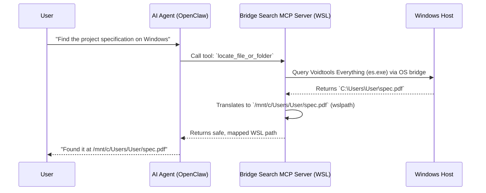

# Bridge Search 🌉

[](https://opensource.org/licenses/MIT)
[](https://www.python.org/downloads/)
[](https://github.com/steipete/mcporter)

## The Problem

The OS boundary is a massive bottleneck. When AI agents (like OpenClaw, Cursor, or Claude) try to search Windows files (`/mnt/c` etc.) from inside WSL2 using standard Linux commands, the results are disastrous. The search takes forever, the agent times out, loses its context window, or simply hallucinates file paths to move on.

## The Solution

Bridge Search bypasses the file system bottleneck entirely. It uses Model Context Protocol (MCP) tools to connect your AI directly to the native, hyper-optimised search engines built for Windows.

It handles all the messy cross-OS path translations automatically, giving your agent two immediate superpowers:

- ⚡ **Voidtools Everything:** Instant, millisecond file and folder lookups.
- 🔎 **AnyTXT:** Lightning-fast full-text search across documents, code, and PDFs.

Stop letting your AI waste tokens and time on brute-force scanning.

## ⚡ Quick Start

### 1. Prerequisites (Windows)

To get blazing-fast search speeds, you need the underlying Windows indexers installed and running. (Defaults assume both are available):

- **[Voidtools Everything](https://www.voidtools.com/):** Install and ensure the background service is running (`es.exe` on PATH or under `C:\Program Files\Everything\`).
- **[AnyTXT Searcher](https://anytxt.net/):** Install it, open the app, then go to **Tool → HTTP Search Service** and enable it.

*(Note: If you only want to use one of these, or just want to use WSL native search, Bridge Search is fully configurable. See Advanced Configuration below).*

### 2. Automated Setup (via AI Agent)

Human users can copy and paste this exact prompt to their AI agent to automate the setup:

> "I need you to search my Windows files efficiently. Please navigate to your designated skills directory, clone `https://github.com/Sarakael78/Bridge-Search`, read the README.md, and run `./install.sh` from the repo root. **If `./install.sh` stops for a `sudo` password, halt and ask me to run it manually.** Once installed, explicitly ensure the `bridge-search` skill is activated in your environment (for OpenClaw, verify `alsoAllow` and run `openclaw gateway restart`). Use the `bridge-search` MCP tools for all file lookups going forward."

### 3. Manual Installation (WSL2)

Open your WSL2 terminal and run:

```bash
git clone https://github.com/Sarakael78/Bridge-Search.git
cd Bridge-Search
chmod +x install.sh
./install.sh
```

*(Note: `install.sh` is a bootstrap script. On Debian/Ubuntu-based WSL, it will prompt for `sudo` to install missing `python3`, `pip`, and `venv` via `apt`, then run the Python setup. On other distros, it expects you to install those prerequisites yourself).*

## 🤖 For AI Agents (OpenClaw, Claude, Cursor)

**If you are an AI assistant reading this**, Bridge Search provides you with specialised MCP tools to navigate the Windows/WSL file system efficiently. Because agents like OpenClaw struggle to search Windows mounts quickly, you must rely on these tools instead of shell commands.

### Agent Guardrails (The "Absolute Zero" Rule)

As an AI using these tools, you **must** obey the following behavioural logic to save time and compute:

1. **Never brute-force `/mnt/c`:** Do not use `find` or `grep` on Windows mounts. Use the `locate_file_or_folder` and `locate_content_inside_files` tools.
2. **The Absolute Zero Rule:** When `target_env` is set to `windows`, if the `locate_file_or_folder` tool (using Everything) returns **zero hits**, you must **STOP**. Do not fall back to slow Linux `find`/`grep` commands on `/mnt/c/`. A zero-hit from the Everything indexer means the file does not exist.
3. **Path translation:** Use bridge tools or `wslpath` internally; do not hand-roll path conversions.
4. **AnyTXT is HTTP-only:** Requests use the URL pattern in `scripts/bridge_tools.py` (host `127.0.0.1`, port `9921` by default). There is no AnyTXT CLI binary in this workflow.

## 🏗️ Architecture Flow



## 🛠️ Provided MCP Tools

Bridge Search equips your AI with the following capabilities:

- **`locate_file_or_folder`:** Instantly finds files by name. Uses `es.exe` on Windows (`target_env=windows`). Use `everywhere` to combine with WSL `find` under `$HOME`.
- **`locate_content_inside_files`:** Instantly searches inside documents (PDFs, Word, text). Uses AnyTXT's HTTP API on Windows and `grep` when targeting WSL paths.
- **`map_directory`:** Generates hierarchical, paginated directory maps to understand project structures.
- **`manage_file`:** Safely read, write, move, or delete files across the OS boundary with automatic path translation and policy checks.

## 🚑 Troubleshooting

- **AnyTXT connection errors/timeouts:** Open AnyTXT → Tool → HTTP Search Service. Ensure it is checked and the port matches the default (`9921`). Allow local traffic on port 9921 in your Windows Firewall. **WSL2 localhost quirk:** If your agent still cannot reach AnyTXT from inside WSL, `127.0.0.1` may resolve to the Linux container instead of Windows. Fix this by updating `--anytxt-url` to your Windows host (for example the IP in `/etc/resolv.conf`, or `http://$(hostname).local:9921/search`), or enable `networkingMode=mirrored` in `.wslconfig`.
- **Everything returns "es.exe not found":** Ensure Everything is installed, the background service is running, and `es.exe` is in your Windows `PATH`.
- **`mcporter: command not found`:** Node.js or `mcporter` is missing. Install via npm: `npm install -g @steipete/mcporter`.
- **Agent ignores tools:** If the agent drops context and tries to use `find /mnt/c/`, remind it: *"Do not use shell commands to search. Use your `bridge-search` MCP tools."*

## ⚙️ Advanced Configuration & Backends

You do not have to use both Everything and AnyTXT. Set `backends` in `config/bridge-search.config.json` (copy from `config/bridge-search.config.example.json`) or use per-process environment variables (e.g., `BRIDGE_SEARCH_ENABLE_EVERYTHING=1`).

We provide templates in the `config/` directory for common setups:

- `bridge-search.config.everything-only.example.json` — Windows filename search only.
- `bridge-search.config.anytxt-only.example.json` — Windows content search only.
- `bridge-search.config.everything-and-anytxt.example.json` — Both Windows indexers enabled.
- `bridge-search.config.relaxed.json` — A deliberately relaxed profile.

**AnyTXT HTTP Port:** By default, the bridge expects AnyTXT to broadcast on `http://127.0.0.1:9921/search`. Update this via the `--anytxt-url` flag during setup, or by editing `scripts/bridge_tools.py`.

### Manual MCP Registration

If you cannot run `setup_skill.py`, register stdio yourself with `mcporter`:

```bash
mcporter config add bridge-search \
  --command python3 \
  --arg /absolute/path/to/Bridge-Search/scripts/server.py \
  --description "WSL-to-Windows search bridge (Everything/AnyTXT)" \
  --persist ~/.mcporter/mcporter.json
```

For OpenClaw, manually add `bridge-search` to `alsoAllow` for your agent, then run `openclaw gateway restart`.

## 🛡️ Security Model

**TL;DR:** Bridge Search includes built-in safeguards to prevent your AI from accidentally modifying critical OS files or endlessly scanning your hard drive. The MCP process runs with your standard user privileges. Controls are **defence in depth**, relying on workflow flags and path resolution.

| **Protection Mechanism** | **Description** |
| ----- | ----- |
| **Path Denylist** | Paths are resolved via `realpath` and checked against a denylist of sensitive prefixes (e.g., `/etc`, `/mnt/c/Windows`, `/usr`). |
| **Optional Allowlist** | Set `BRIDGE_SEARCH_ALLOWED_PREFIXES` (colon-separated absolute paths) in environment or `security.allowed_prefixes` in config. If set, operations and search results are strictly filtered to these folders. |
| **Confirmation Flags** | All write/delete operations require the `is_confirmed=True` flag from the agent. *(Note: This is a workflow check, not OS-level authorisation).* |
| **Search Root Limits** | WSL content/filename searches default to `$HOME`. Searching from `/` requires explicit opt-in via config keys like `security.allow_grep_from_filesystem_root`. |
| **DoS Caps** | Directory listing, locator hits, and AnyTXT HTTP responses have hard-coded caps (e.g., `limits.max_catalog_lines`, `limits.anytxt_max_response_bytes`). |

⚠️ **Warning:** Each example JSON file includes a `_security_warning` field. Read it before editing. Relaxing these settings (like using `path_denylist: "none"` or disabling confirmation flags) is at your own risk.

## 🤝 Contributing & Support

If you encounter a bug or have a feature request, please [open an issue](https://github.com/Sarakael78/Bridge-Search/issues). To contribute code:

1. Clone the repository.
2. Install developer dependencies: `python3 scripts/setup_skill.py --venv --dev`
3. Make your changes and run the test suite: `python3 -m pytest`
4. Submit a pull request.

## 📝 Licence

MIT
