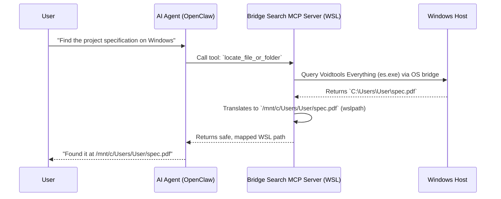

# Bridge Search 🌉

[](https://opensource.org/licenses/MIT)
[](https://www.python.org/downloads/)
[](https://github.com/steipete/mcporter)

## The Problem

The OS boundary is a massive bottleneck. When AI agents (like OpenClaw, Cursor, or Claude) try to search Windows files (`/mnt/c` etc.) from inside WSL2 using standard Linux commands, the results are disastrous. The search takes forever, the agent times out, loses its context window, or simply hallucinates file paths to move on.

## The Solution

Bridge Search bypasses the file system bottleneck entirely. It uses Model Context Protocol (MCP) tools to connect your AI directly to the native, hyper-optimised search engines built for Windows.

It handles all the messy cross-OS path translations automatically, giving your agent two immediate superpowers:

- ⚡ **Voidtools Everything:** Instant, millisecond file and folder lookups.
- 🔎 **AnyTXT:** Lightning-fast full-text search across documents, code, and PDFs.

Stop letting your AI waste tokens and time on brute-force scanning.

## ⚡ Quick Start

### 1. Prerequisites (Windows)

To get blazing-fast search speeds, you need the underlying Windows indexers installed and running. (Defaults assume both are available):

- **[Voidtools Everything](https://www.voidtools.com/):** Install and ensure the background service is running (`es.exe` on PATH or under `C:\Program Files\Everything\`).
- **[AnyTXT Searcher](https://anytxt.net/):** Install it, open the app, then go to **Tool → HTTP Search Service** and enable it.

*(Note: If you only want to use one of these, or just want to use WSL native search, Bridge Search is fully configurable. See Advanced Configuration below).*

### 2. Automated Setup (via AI Agent)

Human users can copy and paste this exact prompt to their AI agent to automate the setup:

> "I need you to search my Windows files efficiently. Please navigate to your designated skills directory, clone `https://github.com/Sarakael78/Bridge-Search`, read **`README.md`** and **`SKILL.md`** in the repo root, then run `./install.sh` from the repo root. **If `./install.sh` stops for a `sudo` password, halt and ask me to run it manually.** Once installed, explicitly ensure the `bridge-search` skill is activated in your environment (for OpenClaw, verify `alsoAllow` and run `openclaw gateway restart`). Use the `bridge-search` MCP tools for all file lookups going forward, obeying the guardrails in **`SKILL.md`**."

### 3. Manual Installation (WSL2)

Open your WSL2 terminal and run:

```bash
git clone https://github.com/Sarakael78/Bridge-Search.git
cd Bridge-Search
chmod +x install.sh
./install.sh
```

The clone directory name is arbitrary (`Bridge-Search` above); the MCP server name used in clients is **`bridge-search`**.

*(Note: `install.sh` is a bootstrap script. On Debian/Ubuntu-based WSL, it will prompt for `sudo` to install missing `python3`, `pip`, and `venv` via `apt`, then run the Python setup. On Fedora/RHEL and other non-`apt` distros, install those packages with your package manager, then run `./install.sh`—it will skip `apt` and run the Python setup only.)*

`install.sh` forwards extra flags to `scripts/setup_skill.py` and defaults to `--venv` (for example: `./install.sh --skip-checks` or `./install.sh --dev`).

### 4. MCP client (`mcporter`) on WSL

The bridge exposes MCP over stdio. **`setup_skill.py`** can register it; otherwise you need **[mcporter](https://github.com/steipete/mcporter)** (or another MCP host that launches `scripts/server.py`). Install Node.js, then:

```bash
npm install -g @steipete/mcporter
```

Manual registration is documented under [Manual MCP Registration](#manual-mcp-registration) below.

## 🤖 For AI Agents (OpenClaw, Claude, Cursor)

**If you are an AI assistant reading this**, Bridge Search provides specialised MCP tools for Windows/WSL file discovery and file operations. Use them instead of shell-searching `/mnt/c` and other Windows mounts.

**`SKILL.md` is the authoritative operational contract for agents.** It intentionally owns:

- guardrails and the Absolute Zero rule
- tool choice and search order
- path policy and `is_confirmed` semantics
- integrations with other skills

Use **`README.md`** for installation, troubleshooting, configuration, and security. That split is deliberate so the agent behavior lives in one place instead of drifting across two docs.

## 🏗️ Architecture Flow



## 🛠️ Provided MCP Tools

Bridge Search equips your AI with the following capabilities:

- **`locate_file_or_folder`:** Instantly finds files by name. Uses `es.exe` on Windows (`target_env=windows`). Use `everywhere` to combine with WSL `find` under `$HOME`.
- **`locate_content_inside_files`**: Instantly searches inside documents (PDFs, Word, text). Uses AnyTXT's HTTP API on Windows and `grep` when targeting WSL paths. Includes automatic host-IP discovery for WSL2.
- **`map_directory`**: Generates hierarchical, paginated directory maps to understand project structures.
- **`get_health`**: Diagnoses the status of all search backends (Everything, AnyTXT, WSL find/grep) and connectivity.
- **`manage_file`**: Safely read, write, move, or delete files across the OS boundary with automatic path translation and policy checks.


### `manage_file` safety rules

`manage_file` is stricter than a raw shell wrapper:

- write and delete still require `is_confirmed=True` when confirmation gates are enabled
- `write` now defaults to **replace**, while append requires `write_mode="append"`
- copy and move will **not** overwrite an existing destination unless `overwrite=True`
- copy and move refuse source and destination paths that resolve to the same location
- copy and move refuse to place a directory inside itself
- delete refuses filesystem root and the current user's home directory
- write returns a structured `destination_parent_missing` error if the parent directory does not exist
- reads try several common text encodings (`utf-8`, `utf-16`, `cp1252`) before giving up
- write/copy/move/mkdir are blocked on symlink paths, while delete removes the symlink itself rather than following it
- file operations use Python filesystem APIs instead of shelling out to `cp`, `mv`, or `rm -rf`

### Unified response contract

All four tools return the same top-level payload shape:

- `success`
- `results`
- `errors`
- `warnings`
- `meta`

Errors and warnings include a stable machine-readable `code`, so callers do not need to parse English prose.

Important:

- a zero-hit search is a valid outcome, so it returns `success: true` with `results: []`
- when multiple backends are queried, `success` may still be `true` if at least one backend returns results; always inspect `errors` and `warnings` for partial failures
- when Windows paths come back from Everything or AnyTXT, Bridge Search translates them to WSL paths when possible and preserves the original as `raw_path`
- `manage_file(read)` returns decoded text in `results[0].content` and may include `results[0].encoding`

### Concrete response examples

**Successful filename search**

```json
{
  "success": true,
  "results": [
    {
      "type": "search_hit",
      "path": "/mnt/c/Users/david/Documents/spec.pdf",
      "raw_path": "C:\\Users\\david\\Documents\\spec.pdf",
      "source": "windows-everything"
    }
  ],
  "errors": [],
  "warnings": [],
  "meta": {
    "total_found": 1
  }
}
```

**Zero-hit search**

```json
{
  "success": true,
  "results": [],
  "errors": [],
  "warnings": [],
  "meta": {
    "total_found": 0
  }
}
```

**Backend error response**

```json
{
  "success": false,
  "results": [],
  "errors": [
    {
      "code": "backend_unavailable",
      "message": "es.exe not found. Check Everything installation or Windows PATH.",
      "source": "windows-everything"
    }
  ],
  "warnings": [],
  "meta": {}
}
```

**Blocked `manage_file` mutation**

```json
{
  "success": false,
  "results": [],
  "errors": [
    {
      "code": "write_confirmation_required",
      "message": "WRITE BLOCKED. Pass is_confirmed=True after reviewing the target path.",
      "path": "/mnt/c/Users/david/Documents/note.txt"
    }
  ],
  "warnings": [],
  "meta": {
    "action": "write"
  }
}
```

### Tool reference

- `get_health()` – No parameters; reports whether Everything, AnyTXT, and the WSL helpers can be reached.
- `locate_file_or_folder(query, target_env="windows", exact_match=False, limit=100, offset=0)` – Filename search.
  - `query` must be non-empty; blank or whitespace-only input returns `query_required`.
  - `target_env` = `windows`, `wsl`, or `everywhere`. Windows results call Everything, WSL results use `find`.
  - Everything native paging (`-viewport-offset`, `-viewport-count`) is used only for `target_env="windows"` so merged `everywhere` paging stays consistent.
  - `limit`/`offset` obey `limits.max_limit` (default 500) and `limits.max_offset` (default 50 000). Paginated responses may set `meta.total_found_is_lower_bound` when paging is capped.
  - Results include both a normalized WSL `path` and the original `raw_path` for Windows hits.
- `locate_content_inside_files(query, target_env="everywhere", wsl_search_path="", limit=50, offset=0)` – AnyTXT (`windows`) plus `grep` (`wsl`).
  - `query` must be non-empty; blank or whitespace-only input returns `query_required`.
  - `wsl_search_path` defaults to `$HOME`; use `allow_grep_from_filesystem_root` or `BRIDGE_SEARCH_ALLOW_ROOT_GREP=1` to allow `/`.
  - Responses may include `line_number` (WSL) or `snippet`/`raw_path` for AnyTXT.
- `map_directory(target_path, max_depth=2, include_extensions=None, exclude_hidden=True, target_env="auto", limit=100, offset=0)` – Paginated directory map.
  - Depth capped by `limits.max_depth`, and listings stop after `limits.max_catalog_lines` entries to avoid blowing the cache.
- `manage_file(action, source_path, destination_path=None, content=None, target_env="wsl", overwrite=False, is_confirmed=False, write_mode="replace")` – Guarded reads/writes.
  - `action` = `read|write|copy|move|delete|mkdir`.
  - `is_confirmed=True` is required for mutations when confirmations are enabled.
  - `write_mode` defaults to `replace`; pass `append` when you explicitly want append semantics.

## 🚑 Troubleshooting

- **AnyTXT connection errors/timeouts:** Bridge Search includes **automatic WSL2 host discovery**. It tries `127.0.0.1` and then your host IP from `/etc/resolv.conf`. Use the **`get_health`** tool to diagnose exactly which URL failed. Ensure AnyTXT Searcher → Tool → HTTP Search Service is enabled on port 9921.
- **`get_health` reports AnyTXT failures:** Health probes hit the same runtime `/search` endpoint (with `?q=healthcheck`) for configured and fallback URLs; a working base UI URL alone is not sufficient.
- **Everything returns "es.exe not found":** Ensure Everything is installed, the background service is running, and `es.exe` is in your Windows `PATH`. Run **`get_health`** to confirm the binary path detected.
- **`mcporter: command not found`:** Node.js or `mcporter` is missing. Install via npm: `npm install -g @steipete/mcporter`.
- **Agent ignores tools:** If the agent drops context and tries to use `find /mnt/c/`, remind it: *"Do not use shell commands to search. Use your `bridge-search` MCP tools."*

## ⚙️ Advanced Configuration & Backends

You do not have to use both Everything and AnyTXT. Set `backends` in `config/bridge-search.config.json` (copy from `config/bridge-search.config.example.json`) or use per-process environment variables (e.g., `BRIDGE_SEARCH_ENABLE_EVERYTHING=1`).

We provide templates in the `config/` directory for common setups:

- `bridge-search.config.everything-only.example.json` — Windows filename search only.
- `bridge-search.config.anytxt-only.example.json` — Windows content search only.
- `bridge-search.config.everything-and-anytxt.example.json` — Both Windows indexers enabled.
- `bridge-search.config.relaxed.json` — A deliberately relaxed profile.

### Configuration reference

#### Config structure
- `service.anytxt_url` (default `http://127.0.0.1:9921/search`). Used by AnyTXT HTTP tool calls.
- `security.path_denylist` (`default`, `minimal`, `custom`, `none`) controls the denylist applied to search paths and file operations.
- `security.custom_restricted_prefixes` + `security.allowed_prefixes` override the deny/allow lists you see in `path_policy.py`. Use absolute WSL paths or Windows-style `C:\...` paths; Windows entries are normalized into WSL form before policy checks.
- `security.allow_grep_from_filesystem_root` & `security.allow_wsl_locator_from_filesystem_root` gate root-level scans.
- `security.require_confirm_for_writes` / `security.require_confirm_for_deletes` keep `manage_file` mutations gated by `is_confirmed`.
- `limits.*` values tune caps:
  - `max_limit`, `max_offset` control the MCP pagination parameters.
  - `max_depth` and `max_catalog_lines` limit `map_directory`.
  - `max_locator_results` bounds `locate_*` backends.
  - `anytxt_max_response_bytes` caps AnyTXT payloads.
  - `command_timeout_seconds` is the default timeout for `es.exe`, `grep`, `wslpath`, and HTTP calls.
  - `max_read_bytes` is the soft limit for `manage_file(read)` before a truncation warning (default 1 048 576 bytes).
- `backends.everything`, `.anytxt`, `.wsl_find`, and `.wsl_grep` enable or disable each search backend.

#### Environment overrides
- `BRIDGE_SEARCH_CONFIG` — absolute path to a different config file.
- `BRIDGE_SEARCH_ANYTXT_URL` — override the AnyTXT HTTP endpoint (normalized to `/search`).
- `BRIDGE_SEARCH_CMD_TIMEOUT_SECONDS` — overrides `limits.command_timeout_seconds`.
- `BRIDGE_SEARCH_ALLOWED_PREFIXES` — allowlist applied to both searches and file ops. The parser accepts `:` or `;`; prefer `;` when any Windows-style `C:\...` prefix is present.
- `BRIDGE_SEARCH_ENABLE_EVERYTHING`, `BRIDGE_SEARCH_ENABLE_ANYTXT`, `BRIDGE_SEARCH_ENABLE_WSL_FIND`, `BRIDGE_SEARCH_ENABLE_WSL_GREP` — toggle each backend on/off.
- `BRIDGE_SEARCH_ALLOW_ROOT_GREP=1` or config `allow_grep_from_filesystem_root` lets WSL `grep` run from `/`.
- `BRIDGE_SEARCH_ALLOW_ROOT_LOCATOR=1` or `allow_wsl_locator_from_filesystem_root` lets `locate_file_or_folder` `find` from `/`.

Example configs now also expose:

- `limits.command_timeout_seconds` for subprocess and HTTP timeout tuning
- a `_write_note` reminder that `manage_file(write)` defaults to replace, while append requires `write_mode="append"` per call

**AnyTXT HTTP URL:** By default, the bridge uses `http://127.0.0.1:9921/search`. Update this via the `--anytxt-url` flag during setup, by editing `config/bridge-search.config.json` (`service.anytxt_url`), or by setting `BRIDGE_SEARCH_ANYTXT_URL`.

**Installer note:** `setup_skill.py` persists the AnyTXT runtime URL into `config/bridge-search.config.json`, and if a `bridge-search` mcporter entry already exists it will replace it instead of failing outright.

### Manual MCP Registration

If you cannot run `setup_skill.py`, register stdio yourself with `mcporter`:

```bash
mcporter config add bridge-search \
  --command python3 \
  --arg /absolute/path/to/Bridge-Search/scripts/server.py \
  --description "WSL-to-Windows search bridge (Everything/AnyTXT)" \
  --persist ~/.mcporter/mcporter.json
```

For OpenClaw, manually add `bridge-search` to `alsoAllow` for your agent, then run `openclaw gateway restart`.

Installer note: `setup_skill.py` no longer edits `~/.openclaw/openclaw.json` unless you explicitly pass `--openclaw-allowlist`.

## 🛡️ Security Model

**TL;DR:** Bridge Search includes built-in safeguards to prevent your AI from accidentally modifying critical OS files or endlessly scanning your hard drive. The MCP process runs with your standard user privileges. Controls are **defence in depth**, relying on workflow flags and path resolution.

| **Protection Mechanism** | **Description** |
| ----- | ----- |
| **Path Denylist** | Paths are resolved via `realpath` and checked against a denylist of sensitive prefixes (e.g., `/etc`, `/mnt/c/Windows`, `/usr`). |
| **Optional Allowlist** | Set `BRIDGE_SEARCH_ALLOWED_PREFIXES` in environment or `security.allowed_prefixes` in config. The env parser accepts `:` or `;`; prefer `;` when any `C:\...` path is present. If set, operations and search results are strictly filtered to these folders. |
| **Confirmation Flags** | All write/delete operations require the `is_confirmed=True` flag from the agent by default. *(Note: This is a workflow check, not OS-level authorisation).* |
| **Safer File Ops** | Copy/move require explicit overwrite opt-in, block self-targeting and copy-into-self mistakes, and delete refuses root and home-directory targets. |
| **Encoding & Symlink Policy** | Text reads try common Windows/Unicode encodings before failing. Mutating operations are blocked on symlink paths so the agent must act on the resolved real path explicitly. |
| **Search Root Limits** | WSL content/filename searches default to `$HOME`. Searching from `/` requires explicit opt-in via config keys like `security.allow_grep_from_filesystem_root`. |
| **Timeouts & DoS Caps** | Directory listing, locator hits, AnyTXT HTTP responses, and subprocess calls have caps/timeouts (for example `limits.max_catalog_lines`, `limits.anytxt_max_response_bytes`, `limits.command_timeout_seconds`). |

⚠️ **Warning:** Each example JSON file includes a `_security_warning` field. Read it before editing. Relaxing these settings (like using `path_denylist: "none"` or disabling confirmation flags) is at your own risk.

## 🧱 Architecture Notes

See `ARCHITECTURE.md` for the internal design, backend flow, pagination strategy, timeout model, and installer posture.

## 🤝 Contributing & Support

If you encounter a bug or have a feature request, please [open an issue](https://github.com/Sarakael78/Bridge-Search/issues). To contribute code:

1. Clone the repository.
2. Install developer dependencies: `python3 scripts/setup_skill.py --venv --dev` (requires **Python 3.10+**).
3. Make your changes and run the test suite: `python3 -m pytest`
4. Submit a pull request.

## 📝 Licence

MIT
